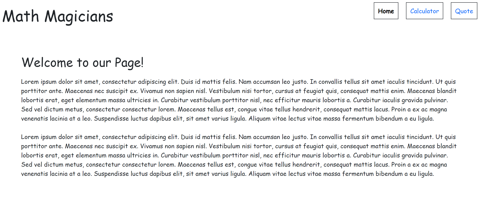
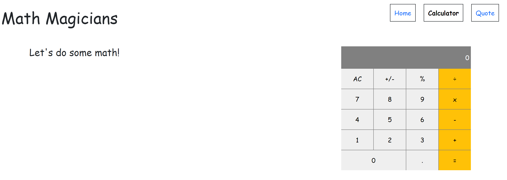
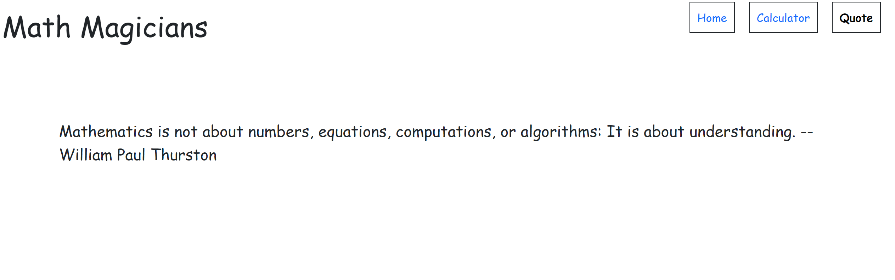

# Math Magician App

> This project is a calculator app built using React

## Live Demo

[Live Demo Link](https://ghiftee.github.io/my-app/)

## Milestone 1: Setup
- In this milestone, I created a new React App using CRA.
- To get started with CRA, see more information below:

#### Getting Started with Create React App

This project was bootstrapped with [Create React App](https://github.com/facebook/create-react-app).

#### Available Scripts

In the project directory, you can run:

#### `npm start`

Runs the app in the development mode.\
Open [http://localhost:3000](http://localhost:3000) to view it in the browser.

The page will reload if you make edits.\
You will also see any lint errors in the console.

#### `npm test`

Launches the test runner in the interactive watch mode.\
See the section about [running tests](https://facebook.github.io/create-react-app/docs/running-tests) for more information.

#### `npm run build`

Builds the app for production to the `build` folder.\
It correctly bundles React in production mode and optimizes the build for the best performance.

The build is minified and the filenames include the hashes.\
Your app is ready to be deployed!

See the section about [deployment](https://facebook.github.io/create-react-app/docs/deployment) for more information.

### Learn More

You can learn more in the [Create React App documentation](https://facebook.github.io/create-react-app/docs/getting-started).

To learn React, check out the [React documentation](https://reactjs.org/).

## Milestone 2: Components
- Delete all the boilerplate from CRA (text, images, styles)
- Create a directory called components
- Create Calculator file with a React component that matches the given UI

## Milestone 3: Events
- Create logic directory
- Copy the files calculate.js and operate.js into a logic directory
- Import the files in previously created Calculator component
- Implement event handlers needed to use the math logic from calculate.js and operate.js
- Practice using state and lift state up

## Milestone 4: Refactor with hooks
- Refactor Calculator component from a class based component to a functional component with hooks.

## Built With
- React, Bootstrap, Webpack, Javascript, Babel and Jest

## Author
👤 **Gift Uwhubetine**

- GitHub: [@githubhandle](https://github.com/ghiftee)
- Twitter: [@twitterhandle](https://twitter.com/i_ghiftee)
- LinkedIn: [LinkedIn](https://linkedin.com/in/giftuwhubetine)

## 🤝 Contributing

Contributions, issues, and feature requests are welcome!

Feel free to check the [issues page](../../issues/).

## Show your support

Give a ⭐️ if you like this project!

## 📝 License

This project is [MIT](./MIT.md) licensed.
